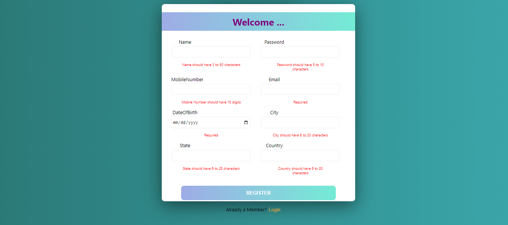
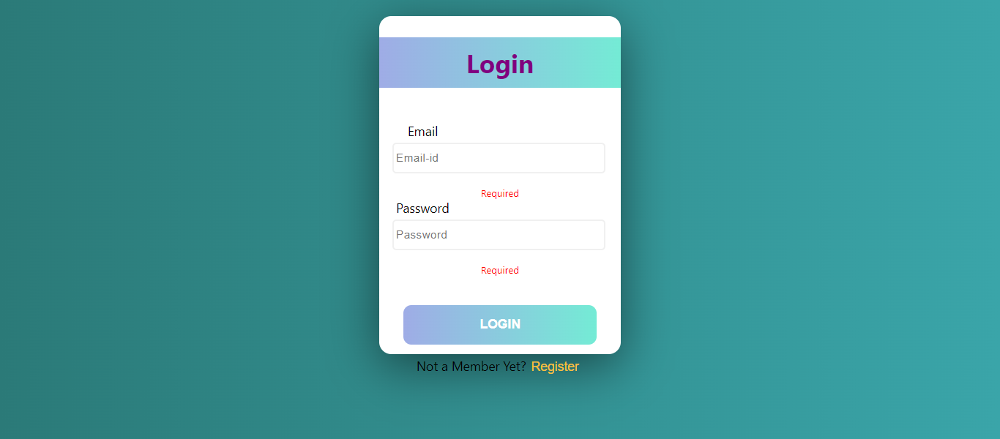

# Form-Validation 
 
In this Project with the help of Toggle Function User can Get the Signin or Login Page 

## Screenshots of Final Output

- SignUp Page


- Login Page


## Styled Components

[Styled-Components - Main Docs](https://styled-components.com/)

```jsx
import styled from "styled-components";

const ReactComponent = () => {
 // logic here
 return <Wrapper>
 {some content}
 </Wrapper>
}


const Wrapper = styled.htmlElement`
write your styles here
`
export default ReactComponent
```


 